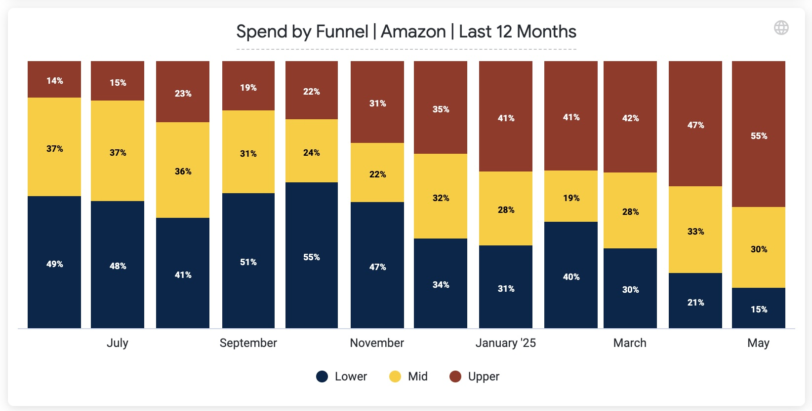

# 📊 Amazon DSP Automation (No-API Integration Pipeline)

### *Unified Amazon Advertising Reporting – Search + DSP Spend Integration via Custom Script + Snowflake Pipeline*

---

## 🚀 Overview

Amazon DSP doesn’t offer a public API, yet our marketing strategy required merging DSP and Search data for holistic budget allocation and performance analysis. To solve this, I engineered a custom automation pipeline that ingested Amazon DSP data daily via email, structured it for ingestion, and merged it with Amazon Search data in Snowflake via Daasity — culminating in a unified Looker dashboard.

---

## 🔧 Tools & Stack

- **Google Apps Script** (for automation)
- **Google Sheets** (interim data store)
- **Daasity** (ETL to Snowflake)
- **Snowflake** (data warehouse)
- **Looker** (final reporting)
- **Amazon DSP Reports (email-based CSVs)**

---

## 🧠 Problem

Amazon DSP lacks an accessible API for campaign performance data. This created a silo, preventing cross-channel performance analysis alongside Amazon Search. The marketing team needed a daily, automated, and reliable method to track total Amazon spend — split clearly between Search and DSP.

---

## 💡 Solution

I built a custom **no-code/low-code pipeline** to bridge the gap:

1. **Email Automation**  
   - Scheduled Amazon DSP reports to be delivered via email daily.
   - Wrote a Google Apps Script to:
     - Search Gmail for the daily email
     - Extract the CSV download link
     - Parse the CSV and clean data
     - Append data to a structured Google Sheet

2. **Data Transformation & Ingestion**
   - Set the script to trigger before Daasity's ETL window.
   - Daasity picked up the clean Google Sheet and loaded it into **Snowflake**.
   - Built **custom views & explores** in Looker to format the DSP data in alignment with Amazon Search datasets.

3. **Unified Reporting**
   - Developed a Looker dashboard using Looker Explores to break out DSP vs. Search spend and KPIs.
   - Enabled side-by-side channel performance views across campaigns, audiences, and targeting types.
  
## 🛠 Automation Script

This [Google Apps Script](amazon-dsp-csv-ingestion.gs) automates ingestion of Amazon DSP reports by:
- Scanning Gmail for daily report emails
- Extracting and decoding CSV download links
- Appending cleaned data into a Google Sheet
- Triggering prior to Daasity’s Snowflake ingestion

> The full script is available [here](amazon-dsp-csv-ingestion.gs).

## 🧩 Looker View: Historical DSP Data Union

To support full historical reporting, Amazon DSP data was split across two large GSheets due to row count limits. I created a Looker view that unions both datasets into a single reporting view, powering the full DSP dashboard from Jan 2023 to today.

> View the Looker view source file: [`view_amazon_dsp_combined_gsheet.view.lkml`](view_amazon_dsp_combined_gsheet.view.lkml)

---

## 📈 Results

- 🔄 **Saved 4–6 hours/week** of manual reporting
- 📊 **First-ever unified Amazon ad reporting** (DSP + Search)
- 💰 **Improved budget allocation** by identifying waste and overlap
- 📉 **Reduced time-to-insight** by 80% for Amazon DSP performance metrics
- ⚙️ **Scalable and fully automated** daily data ingestion pipeline

---

## 📎 Visualization Preview

## 📎 Dashboard Preview

## 📊 Amazon Spend Share by Funnel Type

By automating Amazon DSP data ingestion and enforcing standardized campaign naming conventions (e.g., tags for "Upper", "Mid", "Lower"), we enabled a clean, scalable method to categorize campaigns across both Amazon DSP and Amazon Search by **funnel stage**.

This unified view of total Amazon advertising spend by funnel type allows marketing teams to:

- Quickly assess how budgets are distributed across awareness, consideration, and conversion stages
- Identify under- or over-invested funnel areas
- Align spend allocation with strategic goals such as new customer acquisition or retargeting

> 📈 Visualization below: *Total Amazon Ad Spend Share by Funnel Type (Upper, Mid, Lower)*

---

## ✨ Key Features

- Automated email scraping and CSV parsing
- Integrated Snowflake modeling via Daasity
- Looker Studio dashboard with daily refresh and spend breakdown
- Fully automated — zero manual steps post-deployment

---

## 🗃 Sample Data Model 

| Date       | Channel | Sub Channel | Funnel Type | Spend | Impressions | CTR   | ROAS |
|------------|---------|-------------|-------------|--------|-------------|-------|------|
| 2024-02-10 | DSP     | DSP         | Upper       | $450   | 65,000      | 0.70% | 2.3  |
| 2024-02-10 | DSP     | DSP         | Mid         | $380   | 52,000      | 0.65% | 1.9  |
| 2024-02-10 | DSP     | DSP         | Lower       | $310   | 44,000      | 0.85% | 2.7  |
| 2024-02-10 | Search  | SB          | Upper       | $200   | 15,000      | 1.90% | 3.2  |
| 2024-02-10 | Search  | SP          | Mid         | $220   | 18,500      | 2.10% | 4.0  |
| 2024-02-10 | Search  | SD          | Lower       | $170   | 12,000      | 2.60% | 5.1  |

